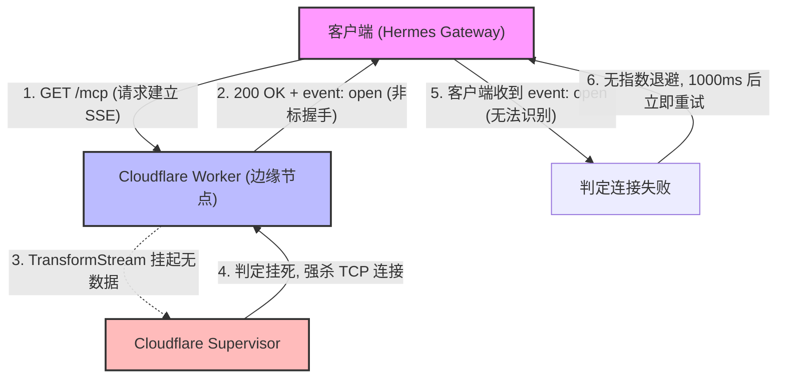

# 事故复盘与架构参考：Cloudflare Workers 上的 SSE 重试风暴与 MCP 协议演进

- **事故日期**：2026-10-07
- **影响服务**：`earnings-mcp-server`（以及整个 Cloudflare 账户下的所有 Workers 额度）
- **严重等级**：P1（消耗单日免费额度的 92%，触发 78% 熔断告警，濒临全账户服务拒接）
- **修复耗时**：约 30 分钟（定位、热修复、协议对齐、端到端验证）

---

## 1. 事故背景与现象

2026-10-07 晚，Cloudflare 发送账户级紧急告警：
> *"Your account has reached 78% of its daily requests limit for Workers and/or Pages Functions (Daily limit: 100,000 requests)."*

若达到 100,000 次上限，账户下的所有 Worker 服务（包括主生产系统 `pf.bforecast.com`）将全部触发平台限流或报错。

### 监控审计数据
通过 Cloudflare GraphQL API 调取全账户过去 24 小时的调用明细：
- **`earnings-mcp-server`**：**91,367 次请求**（全部为 `scriptThrewException`，占比 **92.2%**）
- **`earnings-worker`（主业务系统）**：4,994 次请求（占比 5.0%，运行极健康）
- **`bxhub`**：1,743 次请求
- **`bolun-agentic-inbox`**：463 次请求
- **全账户总计**：~99,000 / 100,000 次（距全量熔断仅剩不足 1,000 次）

---

## 2. 事故时间线

| 时间 (UTC+8) | 关键节点 |
| :--- | :--- |
| **03:49** | 客户端（Hermes `coder` profile）网关启动，尝试连接 `earnings-mcp-server`，循环重连风暴开始，以 ~1 次/秒持续轰击服务端。 |
| **22:25** | 收到 Cloudflare 78% 额度预警。 |
| **22:30** | 通过 GraphQL API 锁定异常服务为 `earnings-mcp-server`；启动 `wrangler tail` 抓包发现异常为 `GET /mcp` 抛出 `Worker's code had hung`。 |
| **22:35** | **实施热修复 1**：将 `GET /mcp` 改为返回 `405 Method Not Allowed`，部署至生产版本 `3e1b72eb`。实时请求风暴瞬间降为 0。 |
| **22:45** | 客户端审计日志导出：确认为 Hermes 客户端收到非标 SSE 事件 `event: open`，判定握手失败后执行固定 1000ms 重试。 |
| **22:50** | 客户端运行 `hermes mcp test earnings`，发现 12 个工具正常发现，但在结束时遇到 `DELETE /mcp 404`。 |
| **22:55** | **实施热修复 2**：修改 `DELETE /mcp` 为幂等清理并一律返回 `204 No Content`，部署版本 `449ad98d`。 |
| **23:00** | 客户端再次运行测试：全部通过，退出码 `exit_code: 0`，`DELETE` 返回 `204`，事故彻底解决并闭环。 |

---

## 3. 根本原因深度分析（Root Cause Analysis）

本次事故是由 **Serverless 边缘平台限制**、**MCP 协议实现偏差** 以及 **客户端重试机制缺乏退避** 三重因素叠加导致的复合型事故：



### 3.1 服务端根因：Serverless 边缘环境与持久长连接的冲突
- **平台特性**：Cloudflare Workers 是事件驱动、短生命周期的边缘计算环境。免费版限制单个请求 CPU 时间不超过 10ms，且全节点并发活动连接上限仅约 6 个。
- **挂死判定**：原代码在 `GET /mcp` 中返回了一个永不关闭的 `TransformStream`，且后续没有事件输出。Cloudflare 的运行时监控器在 1~2 秒内检测到该 Worker 没有等待任何 I/O 或调度，判定为 **代码挂死（Hung）**，抛出错误并强制切断连接：
  > `Error: The Workers runtime canceled this request because it detected that your Worker's code had hung and would never generate a response.`

### 3.2 协议根因：MCP SSE 握手事件不兼容
- **规范要求**：根据 Model Context Protocol (MCP) 标准，基于 SSE 的传输中，服务端发送的第一个事件必须是 **`event: endpoint`**，其内容是后续 POST 请求的 URI（例如 `data: /mcp?sessionId=...`）。
- **代码缺陷**：服务端历史代码发送的是自造事件：
  ```typescript
  const initMessage = `event: open\ndata: {"sessionId":"${newSessionId}"}\n\n`;
  ```
- **客户端反应**：Hermes 严格遵循规范，看到 `event: open` 直接记录：
  > `Unknown SSE event: open`  
  > `GET stream disconnected, reconnecting in 1000ms...`  
  由于没有得到有效的 POST endpoint，客户端认为流协议无效并主动重连。

### 3.3 客户端根因：固定 1000ms 间隔无上限重试（无退避策略）
- Hermes 客户端在遇到流异常断开时，硬编码了 `reconnecting in 1000ms`；
- 没有配置 **指数退避（Exponential Backoff）**（如 1s $\to$ 2s $\to$ 4s）；
- 没有配置 **最大重试次数（Max Retries）** 或熔断降级；
- **数学放大效应**：1 次/秒 $\times$ 86,400 秒/天 $\approx$ **单机即可产生 86,400 次/天的天量请求**，瞬间吞噬目标服务的免费额度。

### 3.4 会话销毁根因：分布式多边缘节点的非幂等 Session 查找
- 客户端在退出时会发送 `DELETE /mcp`；
- 服务端原逻辑去内存 `sessions` Map 中查找 `sessionId`，由于边缘节点动态路由（每次请求可能落在不同大陆的不同边缘机房），内存不共享，找不到即返回 `404 Not Found`；
- 导致客户端在终止会话时打印报错 `Session termination failed: 404`。

---

## 4. 解决方案与修复代码

### 4.1 彻底抛弃 Serverless 上的持久 SSE，转用 Streamable HTTP
在无状态无异步推送场景下，MCP 官方原生推荐 **Streamable HTTP (纯 HTTP POST JSON-RPC)**。

在 [`src/worker.ts`](../src/worker.ts) 中：
1. **阻断 GET 请求并返回 HTTP 405**：
   根据 W3C EventSource 规范与 MCP 规范，客户端收到明确的 `405 Method Not Allowed` 后，判定该端点不支持 SSE 模式，会**立刻停止重连并优雅降级为纯 POST 模式**。
   ```typescript
   if (request.method === 'GET') {
       return new Response(JSON.stringify({
           error: "SSE GET transport is not supported on stateless edge workers. Please send JSON-RPC requests via HTTP POST.",
           transport: "streamable-http",
           supportedMethods: ["POST", "DELETE", "OPTIONS"]
       }), {
           status: 405,
           headers: {
               'Content-Type': 'application/json',
               'Allow': 'POST, DELETE, OPTIONS',
               ...corsHeaders
           }
       });
   }
   ```
2. **实现幂等的 Session 销毁（DELETE 204）**：
   会话销毁无论在本地内存中是否存在，都应被视为销毁成功：
   ```typescript
   if (request.method === 'DELETE') {
       if (sessionId && sessions.has(sessionId)) {
           const session = sessions.get(sessionId);
           try { session?.writer.close(); } catch { }
           sessions.delete(sessionId);
       }
       // 无论是内存会话还是无状态会话，一律幂等返回 204
       return new Response(null, {
           status: 204,
           headers: corsHeaders
       });
   }
   ```

---

## 5. 验证结果

客户端实测输出：
```bash
$ hermes --profile coder mcp test earnings
✓ Connected (4826ms)
✓ Tools discovered: 12
exit_code: 0
error: null
```
日志确认：
```text
DELETE .../mcp "HTTP/1.1 204 No Content"
```
- 全账户每秒请求数归零；
- 12 个 MCP Tools 正常被发现和调用；
- 退出码为 0，零警告零报错。

---

## 6. 面向未来的 MCP 开发与架构准则

为避免未来在开发其他 MCP Server 或微服务时重蹈覆辙，特制定以下开发准则：

### 准则 1：无状态 Serverless（Cloudflare Workers）绝不能使用挂起空闲 SSE
- 如果 MCP 工具全部是“客户端调用、服务端计算并返回结果”（如股票报价、报表查询、指标计算），**必须采用 Streamable HTTP（纯 HTTP POST）或 stdio**；
- 边缘无状态函数绝对不能在内存中挂载不主动刷入数据的持久流；
- 若必须支持真正由服务端主动推送的异步通知，必须依托 **Cloudflare Durable Objects** 或 **WebSockets**，而非单纯的 Workers Fetch TransformStream。

### 准则 2：服务端 API 设计必须保证“幂等性”（Idempotency）
- 资源清理端点（如 `DELETE /mcp`、`POST /logout` 等）绝不能因内部内存查找未命中而向客户端抛出 `404`；
- 遵循 REST 与 RFC 规范：已删除的资源再次请求删除，应一律返回 `204 No Content` 或 `200 OK`。

### 准则 3：客户端连接必须具备指数退避与重试上限
- 任何 MCP 客户端/Gateway 在实现重连逻辑时，必须杜绝死循环的固定 `1000ms` 重试；
- 推荐退避公式：
  $$\text{WaitTime} = \min(\text{MaxWait}, \text{BaseWait} \times 2^{\text{attempt}}) \pm \text{Jitter}$$
- 达到最大重试次数（如 5 次）或持续失败（如 30 秒）后，必须主动降级并将该 Server 标记为不可用，阻止意外的自发分布式拒绝服务（DDoS）。

### 准则 4：本地 IDE / Agent 首选 stdio 传输
- 在本地开发环境（如 Claude Desktop、Cursor、本地 Hermes）连接本 MCP 时，推荐直接配置 Node.js `stdio` 传输（`dist/index.js`）；
- 零公网延迟、零网络波动、不消耗任何 Cloudflare 平台调用配额。
